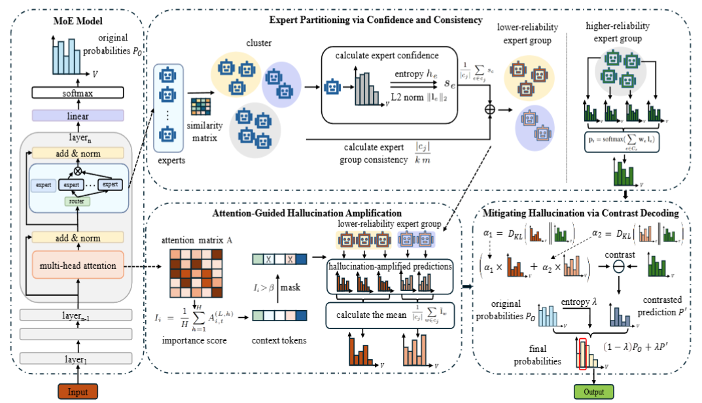
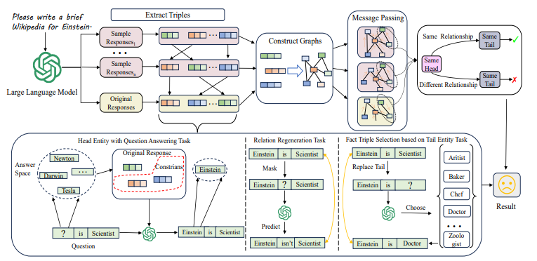
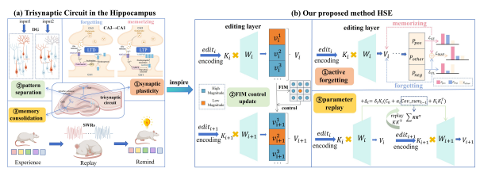
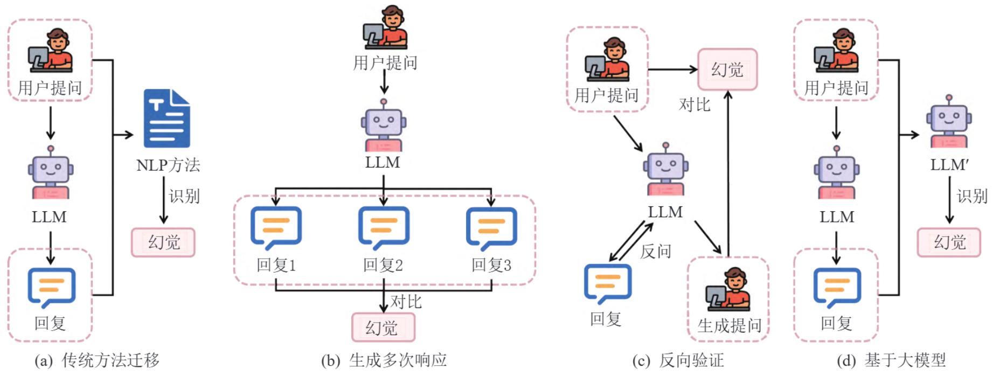








Nice to meet you! I am Xinyue Fang (方馨悦) , currently a Master of Computer Science student in the College of Computer Science and Technology at the National University of Defense Technology (NUDT) , supervised by Prof. Zhiliang Tian (田植良) and Prof. Zhen Huang (黄震). Before joining NUDT, I I received my B.E. degree of Network Engineering degree from the School of Computer Science and Technology at Harbin University of Science and Technology (HRBUST) in 2024.

I focus on building trustworthy AI systems and enhancing model interpretability to enable the safe deployment of AI in real-world applications. My current research interests include:

- **Hallucination in LLMs**: detecting and mitigating hallucinations in complex settings, such as long-form generation, multiple-solution scenarios, and reasoning-chain hallucinations.
- **Large Reasoning Models**: understanding the internal reasoning mechanisms and behaviors of LRMs to further improve their reasoning capabilities, including mitigating overthinking and studying jailbreak attacks and defenses for reasoning processes.
- **Game Theory and Collaboration among LLM-based Agents**: investigating issues such as consensus hallucination, internal strategic behavior, and tool competition in multi-agent systems.

# 🔥 News
- *2026.04*: &nbsp;🎉🎉 One paper about hallucination mitigation in MoE models was accepted by **ACL 2026**!
- *2025.11*: &nbsp;🏆🏆 Honored to receive the **National Scholarship (Top 1)** at NUDT!
- *2025.09*: &nbsp;🎉🎉 One paper about sequential editing for continual knowledge updates was accepted by **NeurIPS 2025**!
- *2025.09*: &nbsp;🎉🎉 A survey paper on hallucination detection methods was accepted by **Journal of Computer Research and Development**!
- *2024.12*: &nbsp;🎉🎉 One paper about hallucination detection via contextual knowledge triples was accepted by **AAAI 2025**!
- *2024.06*: &nbsp;😎😎 I graduated from HRBUST and got the Outstanding Graduate Award of Heilongjiang Province!

# 📝 Publications 

ACL26 Main

[Knowledge Injection Exists in MoE? Exploring Expert-Aware Contrast Decoding in MoE for Mitigating LLMs’ Hallucinations](https://ojs.aaai.org/index.php/AAAI/article/view/34559)

**Xinyue Fang**, Zhiliang Tian, Zhen Huang, Ziyi Pan, Zhihua Wen, Xi Wang, Quntian Fang, Dongsheng Li. 

<strong></strong>
- Proposed an Expert-Aware Adaptive Contrastive Decoding (EAACD) method that leverages expert activation differences and reliability-aware contrastive decoding in MoE models to mitigate hallucinations without external resources or additional training. 

AAAI 2025

[Zero-resource Hallucination Detection for Text Generation via Graph-based Contextual Knowledge Triples Modeling](https://ojs.aaai.org/index.php/AAAI/article/view/34559)

**Xinyue Fang**, Zhen Huang, Zhiliang Tian, Minghui Fang, Ziyi Pan, Quntian Fang, Zhihua Wen, Hengyue Pan, Dongsheng Li. 

<strong></strong>
- Proposed a graph-based context-aware hallucination detection method that leverages knowledge triple graphs and RGCN-based contextual consistency modeling to detect hallucinations in long-form text generation without external resources.

NeurIPS 2025

[Hippocampal-like Sequential Editing for Continual Knowledge Updates in Large Language Models](https://proceedings.neurips.cc/paper_files/paper/2025/hash/0d230e3015b806e7c9cc9afd5ac2c4a9-Abstract-Conference.html)

Quntian Fang, Zhen Huang, Zhiliang Tian, Minghao Hu, Dongsheng Li, Yiping Yao, **Xinyue Fang**, Menglong Lu, Guotong Geng. 

<strong></strong>
- Proposed a Hippocampal-like Sequential Editing (HSE) framework that leverages machine unlearning, Fisher Information Matrix-guided updates, and parameter replay to enable continual knowledge updates in LLMs without catastrophic forgetting or model collapse.

JCRD 2026

[A Survey on Hallucination Detection Methods for Large Language Models](https://kns.cnki.net/kcms2/article/abstract?v=VrduTR4bJX6JlWGysZmZTViANormAuu0d5qUEp6MVBFVNliqVmBWwJrZGk6QKWWU6-OO7hqalzn5tQFz8kgrbwyTZMJpcesHZ4QJhARR4uSP02-YNEvjAi9IHsBfI3ZfxD-XETsCDtak7Lq6rkrE_oqwCPbcUFP-psF7cW15xJo=&uniplatform=NZKPT)

Zituo Li, Jianbin Sun, Guangzhou Chen, **Xinyue Fang**, Ruijing Cui, Zhiliang Tian, Zhen Huang, Kewei Yang. 

<strong></strong>
- Provide a comprehensive survey of hallucination detection methods for large language models, systematically categorizing them into white-box and black-box approaches based on model transparency and practical application requirements.

## Papers Under Review
- HUMAD: Hypergraph-Based Multi-View Fusion for Multi-Answer Hallucination Detection in LLMs. Ziyi Pan, Zhiliang Tian, Zhen Huang, **Xinyue Fang**, Yuquan Shu, Jingyuan Huang, Zhihua Wen, Linbo Qiao, Huaping Hu. (Submitted to **KDD 2026**)

# 📖 Education
- *2024.09 - 2027.07 (Expected)*, **Master of Computer Science**. [National University of Defense Technology (NUDT)](https://www.nudt.edu.cn/), Changsha, China.
  - Supervisors: Prof. Zhiliang Tian & Prof. Zhen Huang.
  - GPA: 3.11/4.00
- *2020.09 - 2024.07*, **Bachelor of Network Engineering**. [Harbin University of Science and Technology (HRBUST)](https://www.hrbust.edu.cn/), Harbin, China. 
  - GPA: 4.55/5.00 (Rank 2/115)

# 🎖 Selected Honors and Awards
- *2025* &nbsp;🏆 National Scholarship (Top 1)
- *2025* &nbsp;🌟 Outstanding Student Award of School of Computer Science in NUDT (Top 10%)
- *2024* &nbsp;🎓 Outstanding Graduate of Heilongjiang Province (Top 1%)
- *2023* &nbsp;🥇 First Prize of the Northeast China Mathematical Modeling Competition
- *2023* &nbsp;💡 Utility Model Patent: "Photovoltaic Power Plant Cleaning Vehicle" - First Inventor
- *2022* &nbsp;🥈 Provincial Second Prize of China Undergraduate Mathematical Contest in Modeling (CUMCM)
- *2021 & 2022* &nbsp;🏅 National Encouragement Scholarship (Twice)
- *2021 & 2022* &nbsp;🎖️ HRBUST First-class scholarship (Twice)
- *2021 & 2022* &nbsp;🌟 HRBUST Merit Student Award (Twice)
- *2021* &nbsp;🥇 Provincial First Prize of China Undergraduate Mathematical Contest in Modeling (CUMCM)

# 🌟 Extra-Curricular Activities
- *2025.09 - 2026.02*, **Teaching Assistant**, Computer Graphics Course of NUDT.
  - Assisted instructors in mentoring students and designing course experiments.
- *2021.09 - 2023.09*, **Team Leader**, Mathematical Modeling Competitions.
  - Led a team to win two provincial first prizes and one provincial second prize.
- *2022.09 - 2023.09*, **Member**, HRBUST Robot Club.
  - Published a utility model patent as the first inventor.

# 🏕️ Hobbies & Contact
- **Reading**: I am a big fan of mystery and suspense fiction, as well as psychology-related literature, which constantly sharpens my logical reasoning and empathy.
- **Outdoors**: I enjoy hiking and mountaineering during my spare time to embrace nature and refresh my mind.
- **Collaboration**: I firmly believe that collaboration leads to win-win outcomes, and I constantly strive to be a trustworthy partner. If you are interested in my research topics or expecting any forms of collaboration, please feel free to contact me! 😊